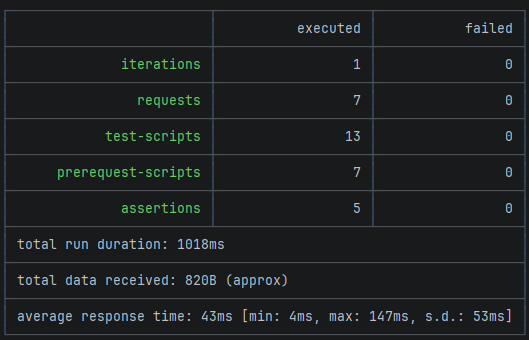

# 🚀 CRUD API con Node.js, Express, MongoDB y Pruebas Automatizadas

Aplicación web completa tipo CRUD que incluye autenticación de usuarios, gestión de ítems y pruebas automatizadas de API.

Este proyecto demuestra habilidades en desarrollo backend, diseño de APIs REST, seguridad básica y automatización de pruebas.

---

##  Características principales

* 🔐 Registro y login de usuarios
* 🔑 Encriptación de contraseñas con bcrypt
* 🧾 Manejo de sesiones con express-session
* 📦 CRUD completo de ítems (Create, Read, Update, Delete)
* 🌐 API REST estructurada
* 📄 Documentación interactiva con Swagger
* 🧪 Pruebas automatizadas con Postman
* ⚡ Ejecución de pruebas con Newman

---

##  Tecnologías utilizadas

* Node.js
* Express.js
* MongoDB
* Mongoose
* bcrypt / bcryptjs
* express-session
* Swagger (swagger-jsdoc + swagger-ui-express)
* Postman
* Newman

---

##  Estructura del proyecto

```
```bash
crud-node-mongo/
│
├─ .idea/
├─ config/
│   └─ config.json
│
├─ models/
│   ├─ Item.js
│   └─ User.js
│
├─ postman/
│   └─ collection.json
│
├─ public/
│   ├─ app.js
│   ├─ index.html
│   ├─ login.html
│   ├─ login.js
│   └─ style.css
│
├─ routes/
│
├─ img.png
├─ README.md
└─ server.js
├─ package.json
└─ package-lock.json
```

---

## ⚙️ Instalación

```bash
git clone https://github.com/jadiazmar/crud-node-mongo.git
cd crud-node-mongo
npm install
```

---

## ▶️ Ejecución del proyecto

```bash
npm start
```

Servidor disponible en:

```
http://localhost:3000
```

---

## 📄 Documentación de la API

Accede a Swagger en:

```
http://localhost:3000/api-docs
```

Desde allí puedes probar todos los endpoints de forma interactiva.

---

## 🔐 Endpoints principales

### Auth

* POST `/api/auth/register`
* POST `/api/auth/login`
* POST `/api/auth/logout`

### Items

* GET `/api/items`
* POST `/api/items`
* PUT `/api/items/{id}`
* DELETE `/api/items/{id}`

---

# 🧪 Pruebas automatizadas con Postman

Se implementaron pruebas automatizadas que permiten validar el funcionamiento de la API sin intervención manual.

## ⚙️ ¿Qué se automatizó?

* ✔ Generación dinámica de datos (usuarios e ítems)
* ✔ Validación de respuestas HTTP (200, 201)
* ✔ Verificación de estructura de datos
* ✔ Almacenamiento automático de IDs
* ✔ Encadenamiento de peticiones (chaining)

---

## 🔄 Generación automática de datos

Se utilizan variables dinámicas de Postman como:

```json
"user_{{$timestamp}}"
"Item_{{$randomInt}}"
```

Esto permite que:

* Cada ejecución cree datos únicos
* Se eviten errores por duplicados
* No sea necesario modificar manualmente los datos

---

## 🔗 Encadenamiento de peticiones

Después de crear un ítem, su ID se guarda automáticamente:

```javascript
const response = pm.response.json();
pm.collectionVariables.set("id", response._id);
```

Luego se reutiliza en:

```
{{baseUrl}}/api/items/{{id}}
```

Esto permite automatizar completamente el flujo CRUD.

---

## ✅ Validaciones implementadas

Ejemplo de test:

```javascript
pm.test("Status 201 Created", function () {
    pm.response.to.have.status(201);
});
```

Estas validaciones garantizan que la API responde correctamente.

---

# ⚡ Ejecución de pruebas con Newman

Newman permite ejecutar la colección de Postman desde la terminal.

---

## Resultado de pruebas automatizadas



## 📦 Instalación

```bash
npm install -g newman
```

---

## ▶️ Ejecutar pruebas

```bash
newman run postman/collection.json
```

---

## 🧠 ¿Qué hace Newman?

* Ejecuta todas las peticiones automáticamente
* Corre los tests definidos
* Genera resultados en consola
* Permite integrar pruebas en CI/CD

---

# 🚀 Valor del proyecto

Este proyecto demuestra:

* Desarrollo de APIs REST completas
* Implementación de autenticación y seguridad básica
* Integración frontend-backend
* Documentación profesional de API
* Automatización de pruebas
* Uso de herramientas de testing como Postman y Newman

---

## 👨‍💻 Autor

**Julian Adolfo Diaz Marquez**

Desarrollador enfocado en backend, automatización y construcción de soluciones prácticas.

---

## 📌 Nota

Este proyecto hace parte de mi portafolio profesional y refleja mis habilidades en desarrollo backend y testing de APIs.
